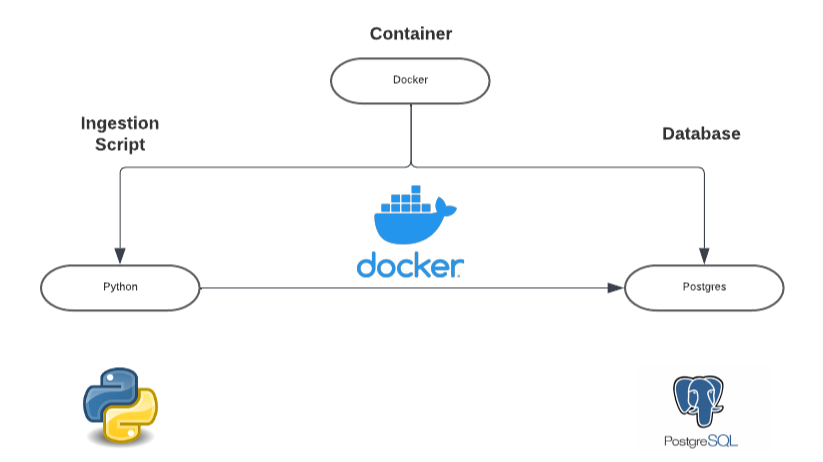

# Docker-Based Data Ingestion Pipeline

## Introduction
This repository contains a Docker-based data ingestion pipeline that automates the extraction, transformation, and loading (ETL) of data into a PostgreSQL database. It leverages Docker to containerize and manage the deployment of a Python script, a PostgreSQL database, and PgAdmin, ensuring seamless interoperability and isolation in a single Docker network.

## Technologies Used
- **Docker**: For creating and managing containers.
- **Python**: For scripting the data ingestion logic.
- **PostgreSQL**: As the relational database to store ingested data.
- **PgAdmin**: For database management and visualization.

## Architecture

*Diagram illustrating the component interactions within the Docker network.*
